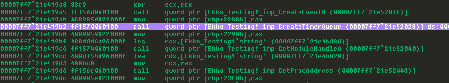
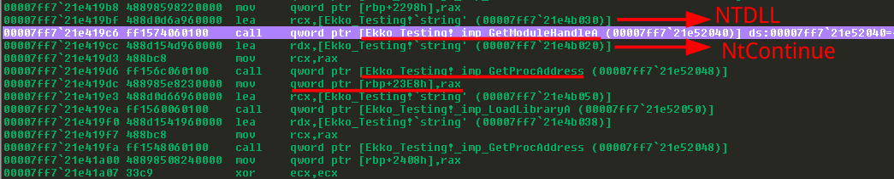
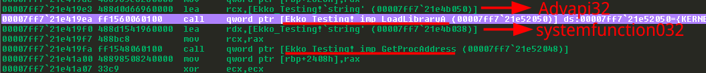
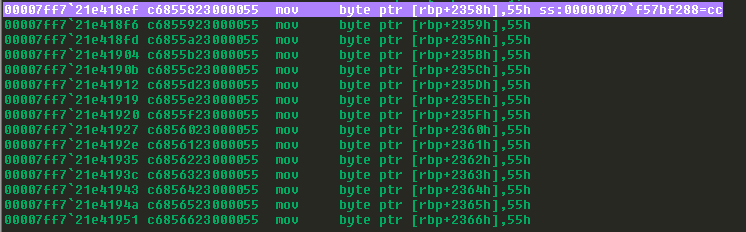
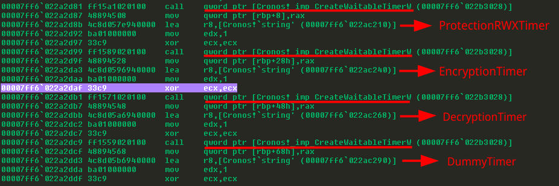
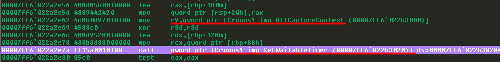
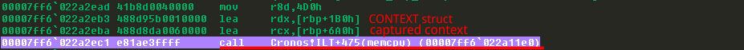
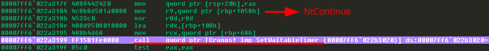
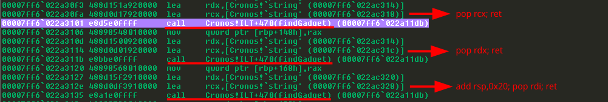
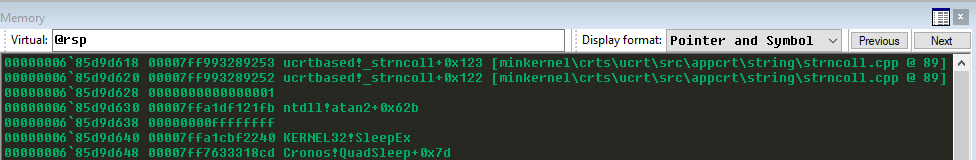

# Let Me Sleep: Overview Of Modern Sleep Obfuscation Techniques

## Introduction

Modern evasive techniques are being used by new generations of malware to circumvent traditional detection mechanisms. These techniques are constantly evolving and incorporating new methods of evasion. This blog delves into the technical workings of modern sleep obfuscation techniques that are being used in modern command and control frameworks.

Malware often resides in memory to evade disk-based detection. In-memory scanners use techniques, such as looking for memory hooks, abnormalities in newly created threads, signature-based memory scanning, and keeping an eye on memory page permissions in order to detect these kinds of malware.

Modern Malware has started using techniques such as Sleep Obfuscations to avoid In-Memory detection systems. This technique involves the use of Windows events to perform sleep/wake mechanisms and employ ROP (Return Oriented Programming) chains to call functions such as VirtualProtect thus modifying memory page permissions. As a result turns a suspicious-looking memory segment into benign, effectively evading detection.

Several Commercial and Open source command and control frameworks have started using these techniques to evade detections. Few examples include :- 
+ Nighthawk
+ Brute Rafael C4
+ Havoc C2 Framework 
+ Cobalt Strike

This method of using windows events to trigger sleep/wake was originally discovered by Peter Winter-Smith and implemented in MDSec’s NightHawk. Although research projects such as Gargoyle (for x86) have tried to develop similar capabilities a few years prior.

In general terms these techniques exploit the fact that In-Memory scanners depend on memory page permissions to scan only pages with specific permissions. The malware makes use of Asynchronous Procedure Call (APC) or Waitable Objects that can be used to trigger change in memory permissions (via ROP Gadgets) and then execute the thread thus staying RW when not executing in order to avoid detections.

Windows Asynchronous Procedure Calls (APC)

Asynchronous procedure calls (APCs) are functions that run asynchronously in the context of a specific thread. The system issues a software interrupt when an APC is queued to a thread. The APC function will be executed the next time the thread is scheduled. A kernel-mode APC is one generated by the system. A user-mode APC is one that is generated by an application.

When a user-mode APC is in a queue, the thread to which it will be queued will not be directed to call an APC function unless it is in an alertable State. A Thread can be placed in an alertable state when it calls functions such as :-

+ SleepEx (used by Cronos Poc)
+ SignalObjectAndWait
+ MsgWaitForMultipleObjectsEx
+ WaitForMultipleObjectsEx
+ WaitForSingleObjectEx (used by Gargoyle Poc and Ekko Poc)

Functions such as WaitForSingleObjectEx are often seen being used in tools such as HavocC2, Gargoyle, DeathSleep etc.

Further ReadFileEx, SetWaitableTimer, SetWaitableTimerEx and WriteFileEx functions also are implemented with the help of an APC as the completion notification callback mechanism.

## Gargoyle : x86 Sleep Obfuscation With ROP Chain

Gargoyle was released in 2016 as a technique that is capable of hiding all of a program’s executable code in non-executable (RW) memory sections. It uses synchapi.h functions such as WaitForSingleObjectEx and Asynchronous Procedure Call to sleep/wake the malware beacon and ROP gadgets to execute code.

For using Waitable Time, it uses CreateWaitableTimer and SetWaitableTimer function calls to create and configure the timer.

CreateWaitableTimer function is used to create a waitable timer object. The Gargoyle creates an unnamed waitable timer. SetWaitableTimer is used to configure the created handle providing time period to sleep, routine to call from waiting thread.

```
HANDLE WINAPI CreateWaitableTimer (
_In_opt_ LPSECURITY_ATTRIBUTES lpTimerAttributes,
_In_ BOOL bManualReset,
 _In_opt_ LPCTSTR lpTimerName
);
```

LARGE_INTEGER *pDueTime defines the amount of time for the first timer expiry. Setting it to zero will make it go off immediately. lPeriod defines the expiration time essentially controlling the frequency at which beacon will be awakened from sleep.

pfnCompletionRoutine is the routine that will be called from the waiting thread. This is where the ROP magic is done to call the malware routine from a non-executable memory section.

```
BOOL WINAPI SetWaitableTimer (
_In_ HANDLE hTimer,
_In_ const LARGE_INTEGER *pDueTime,
_In_ LONG lPeriod,
_In_opt_ PTIMERAPCROUTINE pfnCompletionRoutine,
_In_opt_ LPVOID lpArgToCompletionRoutine,
_In_  BOOL fResume
);
```

Since the permissions of the memory section that contains the malicious code is non-executable, simply running that section from the thread will cause DEP violation.

Now in order to evade the Data Execution Prevention (DEP) violation, Gargoyle uses an ROP gadget to reorient the stack of the executing thread to the address pointed by lpArgToCompletionRoutine and the next argument inside SetWaitableTimer. This reorientation will call VirtualProtectEx to change the memory permissions and mark malicious code as executable before calling it.


ROP Chain: Reorienting The Stack of the Executing Thread
The idea behind the ROP chain is simple. SetWaitableTimer calls pfnCompletionRoutine from the alertable thread. The SetWaitableTimer allows us to give one argument to pfnCompletionRoutine via lpArgToCompletionRoutine. The technique exploits this feature to reorient the stack in such a way that the esp will point to our crafted stack (stack trampoline) and execute VirtualProtectEx to make a memory section of our choice executable.

```
struct StackTrampoline {
void* VirtualProtectEx;
void* return_address;
void* current_process;
void* address;
uint32_t size;
uint32_t protections;
void* old_protections_ptr;
uint32_t old_protections;
void* setup_config;
};
```

The technique requires an exotic ROP gadget “pop * ; pop esp ; ret” which in the demonstrated proof of concept is taken from mshtml.dll (pop ecx; pop esp; ret). Thus in order to make this technique work, the malware will need to load mshtml.dll into memory and leverage it for the ROP chain.

The technique proposed a novel idea of using Windows APC programming and ROP chain in order to trigger functions such as VirtualProtect. Though the concept was new at the time, the implementation of the technique had some serious drawbacks. The need of mounting mshtml.dll for using ROP gadget can be used as a decent detection mechanism. Furthermore the technique only worked for x86 implementation due the nature of ROP chain.
Required ROP Gadgets are present in mshtml.dll

*The analyzed proof of concept leverages a ROP chain to call setup.pic shellcode. For this to work a specific gadget is required which is found in mshtml.dll. Thus mshtml.dll must be loaded in memory for this technique to work.*

## Ekko : Using CreateTimerQueueTimer

The Sleep Obfuscation technique known as Ekko inspired from Foliage came out recently. It also worked on the similar idea of using timers in order to sleep/wake and trigger chained functions. The technique also introduced new concepts such as using undocumented WINAPI function like NtContinue along with some documented WINAPIs such as RltCaptureContext and CONTEXT Structures to replace the previously shown unstable ROP chain.

The proof of concept uses CreateTimerQueueTimer to repeatedly perform an operation after a predetermined amount of time, while WaitForSingleObject is used for actual waiting.

```
BOOL CreateTimerQueueTimer (
  	[out]          		PHANDLE            			phNewTimer,
  	[in, optional] 		HANDLE              			TimerQueue,
  	[in]           		WAITORTIMERCALLBACK 		Callback,
  	[in, optional] 		PVOID               			Parameter,
  	[in]           		DWORD               			DueTime,
  	[in]           		DWORD               			Period,
  	[in]           		ULONG               			Flags
);
```

Other calls to this function includes :-

```
CreateTimerQueueTimer( &hNewTimer, hTimerQueue, RtlCaptureContext, &CtxThread, 0, 0, WT_EXECUTEINTIMERTHREAD )

CreateTimerQueueTimer( &hNewTimer, hTimerQueue, NtContinue, &RopProtRW, 100, 0, WT_EXECUTEINTIMERTHREAD )

CreateTimerQueueTimer( &hNewTimer, hTimerQueue, NtContinue, &RopMemDec, 400, 0, WT_EXECUTEINTIMERTHREAD );
```

CreateTimerQueueTimer returns a handle to an object allocated on the heap rather than a kernel object, showing timer-queue timers are mostly implemented in the usermode and managed by worker thread in ntdll as part of the threadpool implementation.



Further the technique uses NtContinue and along with previously filled CONTEXT structures to execute required functions (ex VirtualProtect) as callback functions.

The technique leverages NtContinue WINAPI to continue the execution and pass control flow to the previously filled structures. This allows the author the ability to chain function calls effectively thus allowing to change memory permissions, decrypting/encrypting the image.

NtContinue is a WINAPI that is included in ntdll.lib but is undocumented. The api is used to continue processing thus effectively transferring control to CONTEXT registers and control cpu registers such as RIP. The majority of the time, one can use a call to  this function as a reliable sign for detection. 

```
NTSYSAPI NTSTATUS NTAPI NtContinue (
IN PCONTEXT             ThreadContext,
IN BOOLEAN              RaiseAlert 
);
```


The function is imported dynamically by using the standard method of creating a HANDLE via GetModuleHandleA and then retrieving the address via GetProcAddress. 


```
NtContinue = GetProcAddress(GetModuleHandleA("Ntdll"), "NtContinue");
```



The encryption and decryption of memory sections to evade in-memory sections is done via another undocumented WINAPI as well SystemFunction032. The api is also dynamically imported as seen before from Advapi32.

```
SysFunc032 = GetProcAddress(LoadLibraryA("Advapi32"), "SystemFunction032");
```





Further a hardcoded key used for rc4 encryption can also be found in memory.

```
CHAR KeyBuf[16] = { 0x55, 0x55, 0x55, 0x55, 0x55, 0x55, 0x55, 0x55, 0x55, 0x55, 0x55, 0x55, 0x55, 0x55, 0x55, 0x55 };
```





Since the use of NtContinue function call is essential to the working of this technique thus it can be leveraged as an reliable indicator. Although other functions such as RltRestoreContext can also be used here

```
NTSYSAPI VOID __cdecl RtlRestoreContext (
PCONTEXT	ContextRecord,
_EXCEPTION_RECORD	*ExceptionRecord
);
```


Ekko supports x86_64 architecture and removes the need of using complex ROP chains in order to work which makes it more stable and easier to implement. Although its reliance on undocumented WINAPI functions can make it susceptible to detections. Overall the technique is fairly simple to implement and can be used in upcoming malware campaigns evading modern detection techniques.

## Cronos : Using CreateWaitableTimerW

Cronos sleep obfuscation technique is similar to ekko in terms that it uses NtContinue and CONTEXT structure to ROP chain functions but differs in terms that it uses different APC calls to sleep and alert the threads. The technique is directly inspired from Gargoyle and Ekko and uses the same undocumented WINAPI call SystemFunction032 to encrypt the memory sections.

The technique makes use of CreateWaitableTimerW present in synchapi.h (windows.h) kernerl32.dll allows to create or open a waitable timer object. This function only creates waitable timers, the handle returned from this function call is later used in SetWaitableTimer to configure parameters and set ROP chain in this case.

```
HANDLE CreateWaitableTimerW(
[in, optional] 		LPSECURITY_ATTRIBUTES		lpTimerAttributes,
[in]           		BOOL                  			bManualReset,
[in, optional] 		LPCWSTR              			lpTimerName
);
```

The waitable timers used in this proof of concept are components of the kernel (kernel timers).





SetWaitableTimer activates the specified timer (HANDLE hTimer) after a given timer period has passed (const LARGE_INTEGER *lpDueTime). The proof of concept here initializes the pfnCompletionRoutine argument as NtContinue and lpArgToCompletionRoutine as CONTEXT structure stack it prepared earlier.

```
BOOL SetWaitableTimer (
[in] HANDLE hTimer,
[in] const LARGE_INTEGER *lpDueTime,
[in] LONG lPeriod,
[in, optional] PTIMERAPCROUTINE pfnCompletionRoutine,
[in, optional] LPVOID hlpArgToCompletionRoutine,
[in] BOOL fResume
);
```



Similar to Ekko an extra instance of Waitable Timer is created and configured to capture the context via RtlCaptureContext and is later used in chaining of the functions using CONTEXT structure and NtContinue.

Moving forward standard procedure is followed that we have seen in earlier discussed techniques. CONTEXT structures are created and filled with captured context via RtlCaptureContext. Further appropriate values to registers such as RSP, RIP, RCX RDX, R8, R9 are set for calling required functions.




### Chaining Functions

The technique used for chaining required functions is almost identical to Ekko. It calls NtContinue routine on completion of Waitable Timer to continue the execution to the crafted CONTEXT structure.  The technique also  uses a few common ROP gadgets (easily available in the memory space) and SleepEx to execute the sleeping functionality.




SleepEx is WINAPI function present in (synchapi.h) that suspends the execution of current thread (sleeps) until a specified condition is met i.e the APC is queued to the thread or given time elapses.

```
DWORD SleepEx(
	 [in] DWORD dwMilliseconds,
	 [in] BOOL  bAlertable
);
```

Before the execution of the next cycle the technique uses a few gadgets to create an ROP chain that essentially calls SleepEx function 4 times (thus the name QuadSleep) and fixes shadow stack in between the calls.

```
findGadget((PBYTE) "\x59\xC3", "xx"); // pop rcx; ret
findGadget((PBYTE) "\x5A\xC3", "xx"); // pop rdx; ret
findGadget((PBYTE) "\x48\x83\xC4\x20\x5F\xC3", "xxxxxx"); // add rsp,0x20; pop rdi; ret
```








The proof of concept employs Waitable Timers in order to achieve the objective of sleep obfuscation rather than using the userland implementation. This allows the technique to bypass detections that may flag techniques such as Ekko and Gargoyle. In brief the technique implements known concepts in a different manner to evade detection and make the malware more stealthy.

## Conclusion

With ever evolving detection technologies, the threat landscape is also evolving. The new generation of sleep obfuscation techniques has proven to be effective in real-life scenarios. They pose a difficult challenge for in-memory scanners which the industry is constantly overcoming and improving upon. The blog talked about 3 major sleep obfuscation techniques with open source code base and fairly simple for Threat Actors to integrate into their pre-existing frameworks.


# References

+ https://suspicious.actor/2022/05/05/mdsec-nighthawk-study.html
+ https://labs.withsecure.com/publications/hunting-for-timer-queue-timers
+ https://lospi.net/security/assembly/c/cpp/developing/software/2017/03/04/gargoyle-memory-analysis-evasion.html
+ https://github.com/y11en/FOLIAGE
+ https://github.com/janoglezcampos/DeathSleep
+ https://github.com/Cracked5pider/Ekko
+ https://github.com/mgeeky/ShellcodeFluctuation
+ https://github.com/JLospinoso/gargoyle
+ https://learn.microsoft.com/en-us/windows/win32/procthread/thread-pool-api
+ https://github.com/mirror/reactos/blob/master/rostests/apitests/ntdll/NtContinue.c
+ http://dongseo.ac.kr/~dkkang/Network2009Fall/W15/APC.pdf

