# RedLine Malware: Stealer Written In .Net

## Executive Summary

Redline Stealer is malware written in .Net that was available for sale on underground forums as a standalone version or subscription basis. The malware was first seen in 2020 March but recently this family of malware has been used in various campaigns conducted by threat actors.

The malware is stealer in nature and harvests information from browsers, ftp, game chat files, game launcher files, messenger client files, nord accounts, browser extensions etc. Enumeration of system inventory is also done when it is run on a target machine to include details such as username, location data and hardware configuration.

The main propagation vector of the malware is phishing. Users are tricked into downloading malware disguised as trusted software such as GCleaner, Anydesk etc. The malware analyzed in this advisory was downloaded from one such active malware hosting server which was hosting 8 different binaries of the same malware family.

It was recently discovered after being offline for a while the command and control server (sozigylkal.xyz) is online once again and the malware seems to be active.


## Description

Redline Stealer is .Net based 32 bit malware that is available as MAAS (Malware As A Service) on underground forums. The malware attack vector is based around social engineering and phishing techniques in order to trick users into installing it. Common variants observed are disguising itself as legit software such as Anydesk or GCleaner.

Once installed, the malware will begin by decrypting the Command and Control string saved in it’s source code and establish an ChannelFactory connection. ChannelFactory connection is an feature of C# language that allows programs to load and execute functions from a remote dll. Malware uses this technique beautifully and loads data exfiltration functions from the remote dll, thus evading normal anti-virus detections.

Malware is stealer in nature and has initialised 22 functions that enumerates various information from the computer such as browsers, ftp, game chat files, game launcher files, messenger client files, nord accounts, browser extensions etc. Further malware also uses open apis to enumerate information about geolocation, blocked domains and other ip related data about the infected machine.

Recent versions of Redline malware also allows attackers to steal cryptocurrency. This family of malware also allows the ability to upload and download files, execute commands and periodically send back information about the infected computer.

After enumerating and collecting all the information from the infected system, they are stored in sqlite files, which is later exfiltrated. Malware does not leave any persistence on the system other than the sqlite files and is killed after a reboot. But it only requires fews minutes on the system to collect and exfiltrate data thus killing the process as soon as it is found is recommended.

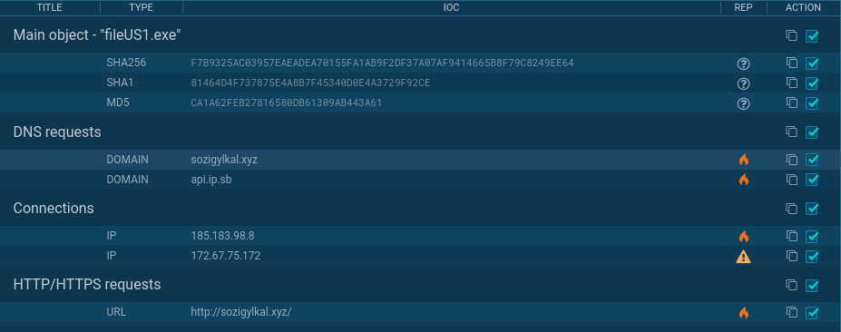


# Detailed Analysis

#### File identification
+ MD5: ca1a62feb27816580db61309ab443a61
+ Sha1: 81464d4f737875e4a8b7f45340d0e4a3729f92ce
+ Sha256: f7b9325ac03957eaeadea70155fa1ab9f2df37a07af9414665b8f79c8249ee64
+ Sha512: e89772e0ede5da977da1f6b074a31fd7240615dd24425ca606981e4ac1ea126ccb4d2ac3e6a70fc5c77812ae4da7eaa52f728fc2db63a38a5d99e2c8039a0372
+ SSDeep: 24576:4P4O1brwerQIWONYxBqSOF7nndOLwfAyX0gV2ozVwTGhPGEd:y5rweFWONYxcSM7n5kh2VwTgv
+ File Size: 1.8MB

#### Format: PE32 executable (GUI) Intel 80386 Mono/.Net assembly, for MS Windows

#### Virus Total
https://www.virustotal.com/gui/file/f7b9325ac03957eaeadea70155fa1ab9f2df37a07af9414665b8f79c8249ee64/detection
#### Malpedia
https://malpedia.caad.fkie.fraunhofer.de/details/win.redline_stealer 

## Malicious File Summary

RedLine Stealer is .Net malware that uses ChannelFactory connection with command and control to load malicious dll and exfiltrate data. The malware is feature rich and allows an attacker to enumerate information on the computer and even download and launch processes on the system.

The malware is obfuscated and thus will require a .Net deobfuscator in order to analyze it. The Use of a tool called de4dot was made in order to deobfuscate the malware.


The main function of the malware is simple, it basically calls the Execute() function via EntryPoint().

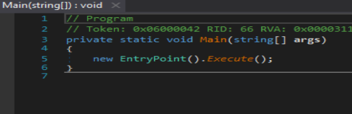

Execute function is where things start to happen in the malware. The first thing the function calls is a decryption routine which decrypts the strings defined in the entry section. In malware that is analyzed in this case there are only two strings defined i.e IP and Key.

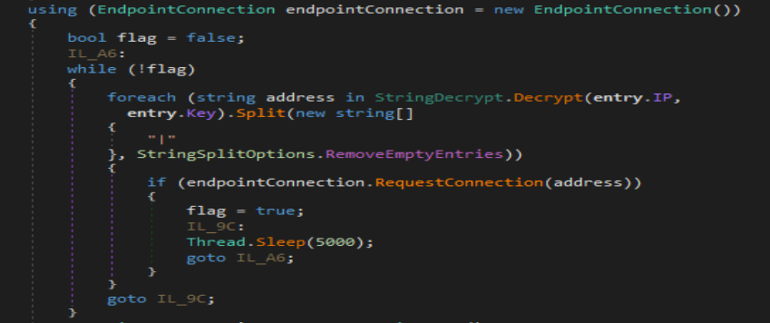

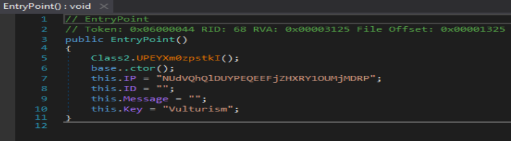


Decryption Routine is simple all it does is decode the string from base64 and xor it with key and base64 decodes the resulting string onces again. A python based implementation of the decryption routine was created in order to retrieve the command and control domain.

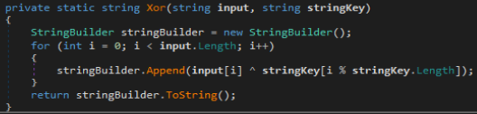

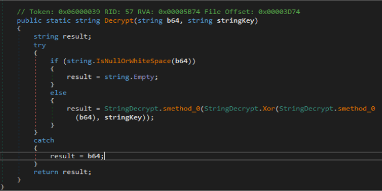


**Python Implementation**

```
from base64 import b64decode

def xor(str_input, key):
    res = ""
    for i in range(0,len(str_input)):
        res += chr(ord(str_input[i]) ^ ord(key[i%len(key)]))
    return res

#result = StringDecrypt.smethod_0(StringDecrypt.Xor(StringDecrypt.smethod_0(b64), stringKey));

def decrypt(b64, key):
    string = b64decode(b64).decode('latin-1')
    string = xor(string,key)
    string = b64decode(string).decode('latin-1')
    return string


key = "Vulturism"
string = "NUdVQhQlDUYPEQEEFjZHXRY1OUMjMDRP"

print(decrypt(string,key))
```

**Decrypted String: sozigylkal.xyz:80**

Once the string is decrypted the a for loop is started to connect to all the domains that were listed in string separated by “|”. Malware creates a ChannelFactory connection to the remote c2 allowing share dll with server. This will allow malware to load and run certain malware from remote dll. Most of the commands that allow malware to run and download files and create processes are all implemented in the remote dll.

This indicated that this malware was written to receive command from more than one command and control framework. The request is successful connection is established a channel is stored in “serviceInterfacce” variable. If any of the listed command and control server is not available the malware will sleep for 5 seconds and then try again.


Once a successful connection is established the malware will run a function called TryGetArgs with class object settings passed as a reference. TryGetArgs will arguments from connection established earlier and it fails to do so then it will return false and report the failure. These arguments saved in the “settings” variable are later used in scanning methods to get more control over what type of data is enumerated and saved by the malware.


ResultFactory.Create is where all the malicious things happen. First it sets up a few lists in the result variable that was passed to it for holding enumerated information then calls several functions and tries to steal as much information as possible from the computer.


“GetGeoStep” function is called the first thing in the enumeration phase. This function tires to enumerate the information about:

+ Ip
+ Location
+ Country
+ PostalCode
+ Blocked Country

The function used the following api in order to get this information

+ https://api.ip.sb/geoip
+ http://checkip.amazonaws.com/
+ https://ipinfo.io/ip
+ https://api.ipify.org
+ https://icanhazip.com
+ https://wtfismyip.com/text
+ http://bot.whatismyipaddress.com/
+ http://checkip.dyndns.org


Once that is all done system enumeration is begun. System enumeration is done by 22 functions labeled from GetHardwareStep1 to GetHardwareStep21. These functions do all the heavy lifting and enumerate everything on the system. This includes:-

+ Browsers
+ FtpConnections
+ GameChatFiles
+ GameLauncherFiles
+ InstalledBrowsers
+ MessageClientFiles
+ NordAccounts
+ Processes
+ Proton
+ ScannedFiles
+ ScannedWallets
+ SecurityUtils
+ Softwares
+ SystemHardwares

Once that is all done, “SeenBefore” function is called which basically checks if the malware was run before and its storage directory is created or not. If the directory is not present it is  created and if present it returns false.

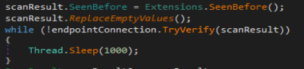

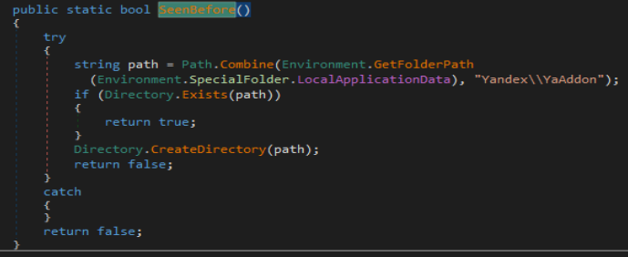

Once that is all done the malware will call function TryGetTasks and then call function TryCompleteTask in order to fetch and run those tasks on the system and exfiltrate information off the system.


Malware utilized Channel Factory to load and call functions off an external dll. This allowed malware to evade few of the Anti viruses out there. Other than that malware showed all the characteristics of a stealer. During execution it collected system information in 21 different steps and even enumerated location, ip, blacklisted domain etc. Further malware allowed the ability to download and launch external executables on the infected system which is different from other malware in the stealer category.

Since the malware is being sold on underground forums, attacks from this malware family will be seen in the future thus deploying defenses against this family of malware will come in handy.
Execution Flow


# Indicator of Compromise

## Command And Control Server

+ **Domain**: sozigylkal.xyz
+ **Country**: ICELAND
+ **Organization**: Privacy service provided by Withheld for Privacy ehf
+ **State**: Capital Region

+ **Ports Open**: 80,22,443


+ **Current IP**: 185.183.98.8


### Ports: 443

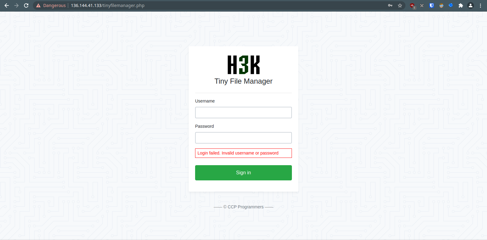

## Malware Hosting Server

IP: 136.144.41.133
City:         San Francisco
Zip Code:     94119
Region Name:  California
Country Name: United States
Latitude:     37.7751
Longitude:    -122.419
Service Running on Port 443: Tiny File Manager


### Files Hosted on Port 80: 8 Files


&nbsp;

File Name | SHA256 Hash
---|---
file10.exe | 8d4044939706fcb684643ae20acb3f8efea6837ad909c219ff7627c10eeadee4
file1.exe | ff0ded61b02aa7c3a68eab0e7306e12b06093aefcdf4232b82738455d13a1d4a
file2.exe | e8104ac6fcd1052611d0de47d66087dccd5e2a0332b26d90d2bd9a68c903330b
file3.exe | 29ea1afb7eff9de6e637ef41710bf77b0d6292c688a5478edd230d08f29d7502
file3s.exe | f47a0c643ec5aa9d2b0302391d39bedfd675abd8892d5a2bd18b66fc303f66f7
file4.exe | 1ad538c4b298f4750efdc59a57f77717ba5fbf8e3ac594cf984af04b85f9a501
file9.exe | 7661bd5c87f1a9ad322c337f11b600dce2b6fe911656ca9fd1aeaf2197451488
fileUS1.exe | f7b9325ac03957eaeadea70155fa1ab9f2df37a07af9414665b8f79c8249ee64

### URLs Reached Out
+ http://sozigylkal.xyz/
+ https://api.ip.sb/geoip
+ http://checkip.amazonaws.com/
+ https://ipinfo.io/ip
+ https://api.ipify.org
+ https://icanhazip.com
+ https://wtfismyip.com/text
+ http://bot.whatismyipaddress.com/
+ http://checkip.dyndns.org/


## Files Dropped

Several Sqlite Files In Path “C:\User\AppData\Local\Temp\”

+ C:\Users\admin\AppData\Local\Temp\tmp6E4A.tmp
+ C:\Users\admin\AppData\Local\Temp\tmp6E5A.tmp
+ C:\Users\admin\AppData\Local\Temp\tmp6E6B.tmp
+ C:\Users\admin\AppData\Local\Temp\tmp6E7C.tmp
+ C:\Users\admin\AppData\Local\Temp\tmp6E39.tmp
+ C:\Users\admin\AppData\Local\Temp\tmp6ECC.tmp


File Contents

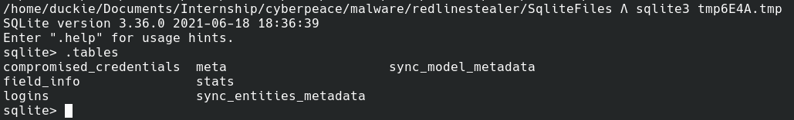
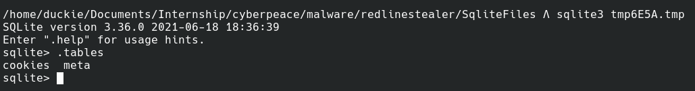


# Yara Rule For Malware Family Detection

```
rule redline_payload {

	meta:
		description = "Rule to detect the RedLine"
        author = "duckie"


	strings:
	$key = "Vulturism"

	$api1 = "https://api.ip.sb/geoip"
	$api2 = "http://checkip.amazonaws.com/"
	$api3 = "https://ipinfo.io/ip"
	$api4 = "https://api.ipify.org"
	$api5 = "https://icanhazip.com"
	$api6 = "https://wtfismyip.com/text"
	$api7 = "http://bot.whatismyipaddress.com/"
	$api8 = "http://checkip.dyndns.org"

	$enumfunc1 = "GetHardwareStep1"
	$enumfunc2 = "GetHardwareStep2"
	$enumfunc3 = "GetHardwareStep3"
	$enumfunc4 = "GetHardwareStep4"
	$enumfunc5 = "GetHardwareStep5"
	$enumfunc6 = "GetHardwareStep6"
	$enumfunc7 = "GetHardwareStep7"
	$enumfunc8 = "GetHardwareStep8"
	$enumfunc9 = "GetHardwareStep9"
	$enumfunc10 = "GetHardwareStep10"
	$enumfunc11 = "GetHardwareStep11"
	$enumfunc12 = "GetHardwareStep12"
	$enumfunc13 = "GetHardwareStep13"
	$enumfunc14 = "GetHardwareStep14"
	$enumfunc15 = "GetHardwareStep15"
	$enumfunc16 = "GetHardwareStep16"
	$enumfunc17 = "GetHardwareStep17"
	$enumfunc18 = "GetHardwareStep18"
	$enumfunc19 = "GetHardwareStep19"
	$enumfunc20 = "GetHardwareStep20"
	$enumfunc21 = "GetHardwareStep21"


	condition:
		($api1 or $api2 or $api3 or $api4 or $api5 or $api6 or $api7 or $api8) or ($enumfunc1  and $enumfunc2  and $enumfunc3  and $enumfunc4  and $enumfunc5  and $enumfunc6  and $enumfunc7  and $enumfunc8  and $enumfunc9  and $enumfunc10 and $enumfunc11 and $enumfunc12 and $enumfunc13 and $enumfunc14 and $enumfunc15 and $enumfunc16 and $enumfunc17 and $enumfunc18 and $enumfunc19 and $enumfunc20 and $enumfunc21) or $key

}
```

# References
+ https://www.virustotal.com/gui/file/f7b9325ac03957eaeadea70155fa1ab9f2df37a07af9414665b8f79c8249ee64/behavior
+ https://malpedia.caad.fkie.fraunhofer.de/details/win.redline_stealer
+ https://blog.morphisec.com/google-ppc-ads-deliver-redline-taurus-and-mini-redline-infostealers
+ https://github.com/StrangerealIntel/CyberThreatIntel/blob/master/Additional%20Analysis/UnknownTA/2020-09-07/Analysis.md

