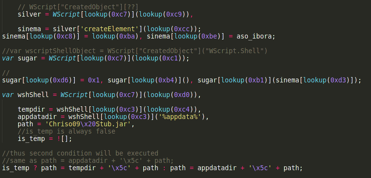
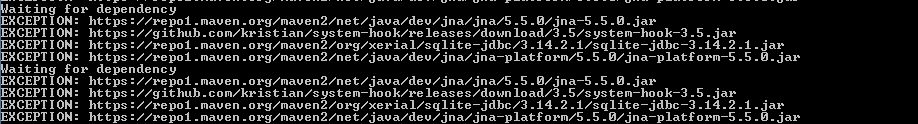
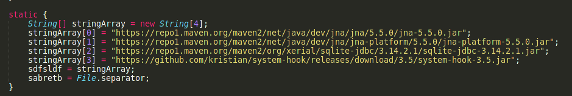
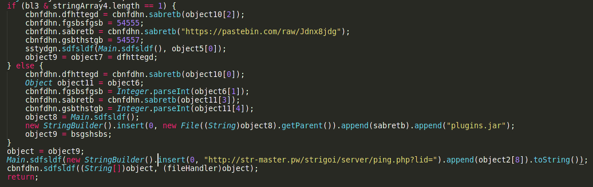

# StrRat Malware: RAT With Ransomware Module

## Executive Summary
StrRat is a Java-Based remote access trojan[1] (RAT) that is delivered by email spam. The malware can not only perform credential theft[2] and allow remote administration of the systems but can also behave as ransomware. This wave of email spam spreading the trojan was discovered by the Microsoft Security Intelligence[3] (MSI) team and they described it as a “massive email campaign”. The campaign was observed on 20 May 2021 and reported in a series of tweets but a similar strain of malware was seen in the wild as earlier as 6 June 2020.

StrRAT remote access malware allows threat actors to perform attacks such as credential theft, installation of key loggers[4] and offers complete remote access of the infected systems—typical characteristics of RAT. The malware also has a functionality to download additional modules from the command and control framework and execute on the infected system.

StrRat malware also offers ransomware features that are not common to other malwares in this category. Earlier versions of this malware only changed the extension of files to .crimson without actually encrypting them. Later actual encryption capabilities were added to the ransomware and the sample we analyzed makes use of AES Encryption[5] Standard to encrypt files and append “.crimson” to them.

The Rat is spread via email spam, phishing techniques and other social engineering attack vectors. The RAT was made with the intention of targeting enterprise users as well as other users. Once inside the network malware acts as a good medium to carry out further attacks.

## Description

To start the attack chain, threat actors used compromised email accounts of several different emails to send malspam with the subject line “Outgoing Payments”. Some emails also used highly specific subjects in order to phish the user in.

The campaign included various emails that made use of social engineering techniques[6] based around payment receipt to trick the user into opening a malicious pdf file. The attached pdf in all these cases, was designed in such a way that on opening it, it connects to a domain that hosts a malicious javascript file that downloads StrRat malware onto the system.

The malware downloaded on the system is jar file and not much obfuscated and on execution it will download all dependencies required to execute attacks such as collecting browser passwords, running remote commands on PowerShell,logging keystrokes etc.

The malware currently requires the java runtime environment to be installed on the infected system in order to execute properly. Other than that the malware does not employ any obfuscation technique but the demo version of Allatori Java Obfuscator. Thus the reverse engineering was easy and variants of this malware would be seen from several threat actors in the future.

# Detailed Static Analysis

## Analysis of Malicious JavaScript File

### File identification

+ MD5: 5e1cbb6566f677da1d920c9d22f59bd7
+ Sha1: 32e31e15fe42e4cb9e2a03698a5c7bc386311eb6
+ Sha256: a1660698b8655cb721f71693178d2804caba8aa12c3a25446c6f7c665a30f2ff
+ Sha512: 6ffa6cb201b2c20403214072b41cafc0e3c3fefe642d475679f63b60b8cd607e090586ece4e86958337638fd87004df20e4f9946ac00fd29482aa0a951dedd66
+ SSDeep: 3072:z3hdaQo7VJH7cEIWrnLNF9CX1UbPU/If7z8gPXP68:LaQo37TIcEX1UbQIH8g/PV
+ File Size: 138549 Bytes

#### Virus Total
https://www.virustotal.com/gui/file/a1660698b8655cb721f71693178d2804caba8aa12c3a25446c6f7c665a30f2ff/behavior/Lastline

#### Malware Bazaar
https://malshare.com/sample.php?action=detail&hash=5e1cbb6566f677da1d920c9d22f59bd7

## Malicious File Summary
The malware attack works in two stages: first the malicious javascript file acts as a dropper and downloads a jar file as ‘%appdata%/Chriso09 Stub.jar’. The file is not downloaded from anywhere but is stored inside the javascript source as base64 encoded. The javascript file was obfuscated but it was not hard to understand what was happening.

The javascript makes a string array called “_0xfe1d7e” that was not initialized in the script and was used to call functions inside WScript. Here the variable is renamed to “lookup”



## Analysis of Malicious Jar File
### Filename: “Chriso09 Stub.jar”
Static Analysis
File Info
+ Md5: 577842a3d036c81926204ccbf5333da1
+ Sha1: 674933be0aad1d7c514adab4f954f7dfd5432e58
+ Sha256: 5d5ed41f5159cf4d0d15b235e0b2f510a967022e8537f872a1dee627485cdd77
+ SSDeep: 1536:T9/A1ArWP1U9QG1+j7tc06nGSpPsrf609pL/2jmTiY+he3qtHGvdvxMpBHrP8a:T9drWP1gQ/j0GsPqfj99/2CTF3qUvELD

+ File Size: 94770

## Malicious File Summary
The malware is written in java and executed as a jar file. Since the malware is a jar file, it was trivial to extract the entire source code of the malware.The malware was obfuscated with nothing but the Allatori Java Obfuscator.


```
afhshsghsh.java
agafhas.java
bmcvbmd.java
bncbndfhd.java
bsgshsbs.java
cbnfdhn.java
cbngh.java
cnbcmhgm.java
cnbfdjf.java
dfghdmc.java
dfhdfndfg.java
dfhttegd.java
dgdfndnbcn.java
dhgdghd.java
dhgfgh.java
dncbnf.java
dndghd.java
dsgsdfge.java
ertdbdth.java
fdghdmh.java
fgfnbnc.java
fgsbsfgsb.java
fgssdg.java
fhfhjfg.java
fhjtjtg.java
fileHandler.java
GDI32.java
ghdfdndfn.java
ghgmgf.java
ghsghnbn.java
gmgmgmgm.java
gsbthstgb.java
HBrowserNativeApis.java
hghteerd.java
Kernel32.java
Main.java
mdgghtdsh.java
mfghnb.java
ncbndfg.java
ncgdfhbn.java
ncnndfg.java
nddfgndt.java
ndgdfhfh.java
ngdnbn.java
nndfdffd.java
sabretb.java
sbsbgsrg.java
sbsgssdfg.java
sdfsldf.java
sfsrgsbd.java
sghthrt.java
sgsfghhg.java
sgsghshdg.java
shshnfdn.java
ssdgsbh.java
sstydgn.java
thrhhrth.java
thtyrths.java
User32.java
WinGDI.java
xbvcxnx.java
xbxcv.java
xcdghdgdn.java
xncxbc.java
xndfgd.java
xnfghdgh.java
xnxcxvb.java
xvbxbg.java
y.java
```


The use of cfr java decompiler was made to get this source code. One can see that most of the classes are obfuscated but few classes such User32, Kernel32, HBrowserNativeApis and GDI32 maintained their full name.

When the malware is run, it clearly shows that it was obfuscated using the Allatori demo version. The malware is feature rich and doesn't do much in order to make the reverse engineering process difficult. The malware requires a stable internet connection in order to execute properly as it downloads many dependencies and uses many pastebins to exploit the system properly.


Also the malware is noisy and doesn't care much about hiding and on execution, starts to download dependencies from the internet. This process is repeated until these dependencies are downloaded successfully.




In order to deobfuscate the malware, you can use online available tools such as Java DeObfuscator or use a custom tool like we did in this case. After deobfuscating the malware it becomes trivial to understand what the malware is doing. Once done use the cfr to decompile the jar file to java source code.

```
java -jar /opt/cfr/cfr-0.151.jar --outputpath sample2/ output.jar
```

Malware starts by downloading the dependencies off the internet and makes some requests to pastebins which now have been removed and after it pings what seems to be a c2 server for keeping track of all the computers compromised.



Once that is all done then the malware will try to create persistence on the computer so it can survive reboots and can exist on the computer for a long period of time. The malware creates a scheduled task with the name of skype. The file is also run in the current execution environment before the persistence is done.

```
if (object2[7].equals("true")) {
                    Runtime.getRuntime().exec(new StringBuilder().insert(0, "cmd /c schtasks /create /sc minute /mo 30 /tn Skype /tr \"").append((String)object12).append("\"").toString());
                }
```

Further malware also creates registry based persistence by modifying the following hives:

```
<HKCU>\Software\Microsoft\Windows\CurrentVersion\Run\Chriso09 Stub
<HKLM>\Software\Microsoft\Windows\CurrentVersion\Run\Chriso09 Stub
```

The malware is well written and allows an attacker to do whatever he/she wants on the system. Thus it would be foolish technique if during incident response one only checks for this scheduled task for removing persistence.

The feature rich backdoor of the malware allows it to be a versatile tool after being installed on the victim machine. The malware even has a feature to reach out to the http://ip-api.com/json/ in order to confirm the timezone and report back.

The working of the backdoor is simple. All the information about c2 and other data that can be used to traceback the threat actor is stored inside a file “resources/config.txt”. This file is encrypted with an AES scheme and uses the password “strigoi” for decryption.

```
private static /* synthetic */ String[] bsgshsbs() {
        try {
            InputStream inputStream = Main.class.getResourceAsStream("resources/config.txt");
            Object object = new StringBuilder();
            byte[] byArray = new byte[1024];
            InputStream inputStream2 = inputStream;
            while (true) {
                int n;
                if ((n = inputStream2.read(byArray, 0, 1024)) == -1) break;
                ((StringBuilder)object).append(new String(byArray, 0, n));
                inputStream2 = inputStream;
            }
            inputStream.close();
            byte[] byArray2 = DatatypeConverter.parseBase64Binary((String)((StringBuilder)object).toString());
            object = carLambo.sabretb.dfhttegd("strigoi", byArray2);
            return new String((byte[])object, "UTF-8").split("\\|");
        }
        catch (Exception exception) {
            return null;
        }
    }
```
## Rat Features

Command | Description
---|---
reboot | Reboots the infected system
shutdown | Shuts down the infected System
uninstall | Removes the persistence of the malware by removing the persistence
disconnect | Kills the connection
down-n-exec | Downloads a file from the given ip  and executes it
update | Kill the connection, then run the file in the start menu.
up-n-exec | Runs a file given by name. Has fancy features to identify the extension and then run it cmd.exe
remote-cmd | Runs the given command with cmd
power-shell | Runs command with powershell
file-manager | Gives commands to navigate and make changes to file system
keylogger | Logs keystrokes and sends them back
o-keylogger | Starts offline keylogger
process | Dumps running processes
startup-list | WMI dump a list of autorun entries
remote-screen | Remote control the infected computer
rev-proxy | Start a reverse proxy connection
hrdp-new | Downloads the tool called HRDPInst.exe
hrdp-res | Downloads the tools called HRDPInst.exe for specific users.
chrome-pass | Dumps the chrome saved password
foxmail-pass | Dumps foxmail credentials
outlook-pass | Dumps Outlook Credentials
fox-pass | Dumps firefox credentials
tb-pass | Dumps thunderbird credentials
ie-pass | Dumps Internet Explorer credentials
all-pass | Extracts all credentials
chk-priv | Check if running as administrator user
req-priv | Tries to run as administrator user
rw-encrypt | Encrypts the filesystem with AES
rw-decrypt | Decrypts the filesystem with AES
show-msg | Shows message with notepad.exe


The malware is sophisticated and provides several features and things that it can do on infected computers. But detecting and removing the malware is easy. Microsoft 365 defender provides coordinated defense against these kinds of threats. Thus relying on Microsoft defender for Office 365 protection against malicious emails can work to great extent in order to stop these kinds of attacks. Further this advisory offers some detection rules that can be used in order to detect and remove malware from infected systems.
Indicator of Compromise

## URLs Called
+ https://github.com/kristian/system-hook/releases/download/3.5/system-hook-3.5.jar
+ https://pastebin.com/raw/Jdnx8jdg
+ https://pastebin.com/raw/NAEwG3TH
+ https://repo1.maven.org/maven2/net/java/dev/jna/jna/5.5.0/jna-5.5.0.jar
+ https://repo1.maven.org/maven2/net/java/dev/jna/jna-platform/5.5.0/jna-platform-5.5.0.jar
+ https://repo1.maven.org/maven2/org/xerial/sqlite-jdbc/3.14.2.1/sqlite-jdbc-3.14.2.1.jar
+ http://str-master.pw/strigoi/server/ping.php?lid=
+ http://wshsoft.company/multrdp.jpg
+ http://www.allatori.com

## IP’s Reached Out
+ 199.232.196.209
+ 140.82.121.3
+ 185.199.111.154
+ 67.199.248.10
+ 208.95.112.1
+ 185.38.142.241


## Command Executed
+ "C:\Program Files\Java\jre7\bin\javaw.exe" -jar C:\Users\Lucas\AppData\Local\Temp\SCbjyWCdc.jar 
+ wscript C:\Users\Lucas\obsrmtvwfv.js 
+ "C:\Program Files\Java\jre7\bin\javaw.exe" -jar C:\Users\Lucas\AppData\Roaming\ebjsencja.txt 
+ "C:\Program Files\Java\jre7\bin\java.exe" -jar C:\Users\Lucas\ebjsencja.txt 
+ cmd /c schtasks /create /sc minute /mo 30 /tn Skype /tr C:\Users\Lucas\AppData\Roaming\ebjsencja.txt 
+ "C:\Program Files\Java\jre7\bin\java.exe" -jar C:\Users\Lucas\AppData\Roaming\ebjsencja.txt 
+ schtasks /create /sc minute /mo 30 /tn Skype /tr C:\Users\Lucas\AppData\Roaming\ebjsencja.txt 
+ cmd.exe /c "wmic /node:. /namespace:'\root\cimv2' path win32_logicaldisk get volumeserialnumber /format:list" 
+ wmic /node:. /namespace:\root\cimv2 path win32_logicaldisk get volumeserialnumber /format:list 
+ cmd.exe /c "wmic /node:. /namespace:'\root\cimv2' path win32_operatingsystem get caption,OSArchitecture /format:list" 
+ wmic /node:. /namespace:\root\cimv2 path win32_operatingsystem get caption,OSArchitecture /format:list 
+ cmd.exe /c "wmic /node:. /namespace:'\root\cimv2' path win32_operatingsystem get version /format:list" 
+ wmic /node:. /namespace:\root\cimv2 path win32_operatingsystem get version /format:list 
+ cmd.exe /c "wmic /node:localhost /namespace:'\root\securitycenter' path antivirusproduct get displayname /format:list" 
+ wmic /node:localhost /namespace:\root\securitycenter path antivirusproduct get displayname /format:list

## File Downloaded
%ALLUSERSPROFILE%\microsoft\windows\start menu\programs\startup\chriso09 stub.jar
%TEMP%\jna-3599307\jna5977443775388783035.dll
%TEMP%\jna-3599307\jna7951795970086816532.dll
%APPDATA%\chriso09 stub.jar
%APPDATA%\lib\jna-5.5.0.jar
%APPDATA%\lib\jna-platform-5.5.0.jar
%APPDATA%\lib\sqlite-jdbc-3.14.2.1.jar
%APPDATA%\lib\system-hook-3.5.jar
%APPDATA%\microsoft\windows\start menu\programs\startup\chriso09 stub.jar
%HOMEPATH%\chriso09 stub.jar

# Mitigation Strategy And Techniques
Microsoft 365 Defender can be used to defend systems from this stain of malware. Following queries can be used in order to identify malicious behaviour related to StrRat and similar threats.

## Inspecting Machines for Malware

```
DeviceProcessEvents
| where InitiatingProcessFileName in~("java.exe", "javaw.exe") and InitiatingProcessCommandLine has "roaming"
| where FileName == 'cmd.exe' and ProcessCommandLine has 'path antivirusproduct get displayname'
```

## Inspecting Emails For Malicious Spam
```
EmailUrlInfo
| where UrlDomain has_any ('metroscaffingltg.co.uk',
'pg-finacesolutions.co.uk',
'jpfletcherconsultancy.co.uk',
'buildersworlinc.co.uk',
'bentlyconstbuild.co.uk',
'alfredoscafeltd.co.uk',
'zincocorporation.co.uk',
'playerscircleinc.co.uk',
'tg-cranedinc.co.uk',
'adamridley.co.uk',
'westcoasttrustedtaxis.co.uk',
'sivospremiumclub.co.uk',
'gossyexperience.co.uk',
'jeffersonsandc.co.uk',
'fillinaresortsltd.co.uk',
'tk-consultancyltd.co.uk')
```

## Inspecting Machines For Malware Persistence

```
DeviceProcessEvents
| where InitiatingProcessFileName in~("java.exe","javaw.exe")
| where FileName == 'cmd.exe' and ProcessCommandLine has_all("schtasks /create", "tn Skype")

Intrusion Detection System Rules
Sslbl: Malicious Ja3 Ssl-client Fingerprint Detected (Tofsee)
alert tls any any -> any any (msg:"SSLBL: Malicious JA3 SSL-Client Fingerprint detected (Tofsee)"; ja3_hash; content:"a61299f9b501adcf680b9275d79d4ac6"; reference:url, sslbl.abuse.ch/ja3-fingerprints/a61299f9b501adcf680b9275d79d4ac6/; sid:906200050; rev:1;)
```
## Malware Strrat Cnc Checkin

```
alert tcp $HOME_NET any -> $EXTERNAL_NET any (msg:"ET MALWARE STRRAT CnC Checkin"; flow:established,to_server; dsize:<300; content:"ping|7c|STRRAT|7c|"; depth:12; fast_pattern; content:"|7c|"; distance:0; content:"|7c|"; distance:0; content:"|7c|"; distance:0; content:"|7c|"; distance:0; content:"|7c|"; distance:0; classtype:command-and-control; sid:2030358; rev:1; metadata:affected_product Windows_XP_Vista_7_8_10_Server_32_64_Bit, attack_target Client_Endpoint, created_at 2020_06_19, deployment Perimeter, former_category MALWARE, malware_family STRRAT, signature_severity Major, updated_at 2020_06_19;)
```

## Yara Rule For Detection

```
import "hash"
rule detect_strrat_malware {
	meta:
		description = "Detects StrRat Malware"
		organisation = "cyberpeace"
		date = "2021-06-7"

	strings:
		$magic = { 50 4b }
		$string1 = "nozoccqvdu/resources/neomcrngiw"
		$string2 = "nozoccqvdu/Msrbpteacsm.class"
		$string3 = "nozoccqvdu/resources/neomcrngiw"
		$string4 = "nozoccqvdu/Mgutdjgplhq.class"
		$string5 = "nozoccqvdu/Mjowcbqlzyz.class"
		$string6 = "nozoccqvdu/Msrbpteacsm.class"

	condition:
		($magic and $string1 or $string2 or $string3 or $string4 or $string5 or $string6) or
		hash.sha256(0,filesize)== "0be8c1fa0f4bdb66183b738755281d821c53974385c79ddeeca657d91f937db5"
}
```

# References

1. http://www.anvari.org/fortune/Miscellaneous_Collections/291162_trojan-horse-coined-by-mit-hacker-turned-nsa-spook-dan-edwards-n.html
1. https://searchsecurity.techtarget.com/definition/credential-theft
1. https://twitter.com/msftsecintel/status/1395138347601854465
1. https://web.archive.org/web/20130911175015/http://oxforddictionaries.com/definition/english/keylogger
1. https://nvlpubs.nist.gov/nistpubs/FIPS/NIST.FIPS.197.pdf
1. https://simple.wikipedia.org/wiki/Social_engineering_(security)
1. https://malpedia.caad.fkie.fraunhofer.de/details/jar.strrat
1. https://thehackernews.com/2021/05/microsoft-warns-of-data-stealing.html
1. https://bazaar.abuse.ch/browse.php?search=tag%3ASTRRAT
1. https://www.virustotal.com/gui/file/efb6c8d5f71fd6d8f971f71267ecef5b6bb9b881bcca795113bfb05c514ce00f/detection
1. https://www.virustotal.com/gui/file/5d5ed41f5159cf4d0d15b235e0b2f510a967022e8537f872a1dee627485cdd77/details
1. https://www.virustotal.com/gui/file/0be8c1fa0f4bdb66183b738755281d821c53974385c79ddeeca657d91f937db5/detection
1. https://resources.infosecinstitute.com/topic/reverse-engineering-javascript-obfuscated-dropper/
1. https://www.virustotal.com/gui/file/a1660698b8655cb721f71693178d2804caba8aa12c3a25446c6f7c665a30f2ff/detection
1. https://threatpost.com/email-campaign-fake-ransomware-rat/166378/
1. https://github.com/microsoft/Microsoft-365-Defender-Hunting-Queries/tree/master/Campaigns/StrRAT%20malware
